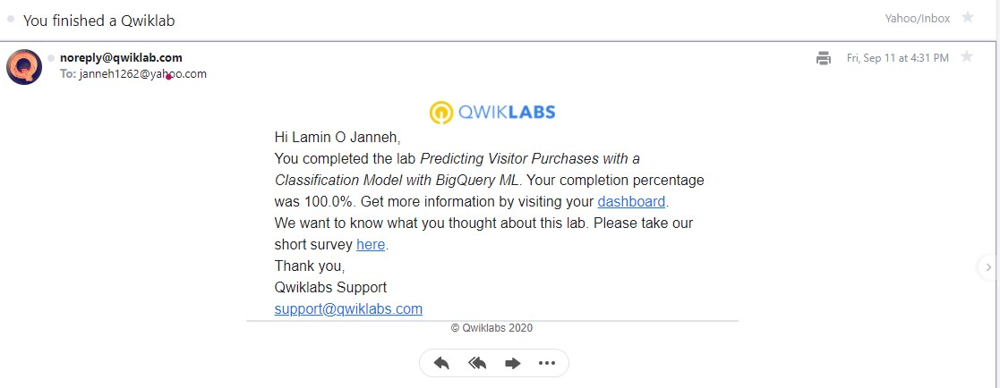

<!-- Change title below -->

# GADS-2020-PROJECT-SUBMISSION

## QwikLabs Completed

<details>
  <!-- The complete lab title goes here 👇🏾-->
  <summary>Lab 1: Getting Started with BigQuery</summary>
  <!-- Provide path to the screenshot here. Example 👇🏾-->
  
</details>

<details>
  <!-- The complete lab title goes here 👇🏾-->
  <summary>Lab 2: App Dev: Setting up a Development Environment v1.1.</summary>
  <!-- Provide path to the screenshot here. Example 👇🏾-->
  
</details>


<details>
  <!-- The complete lab title goes here 👇🏾-->
  <summary>Lab 3: Monitoring Applications in Google Cloud 1.</summary>
  <!-- Provide path to the screenshot here. Example 👇🏾-->
  
</details>

<details>
  <!-- The complete lab title goes here 👇🏾-->
  <summary>Lab 4:Classifying Images of Clouds in the Cloud with AutoML Vision</summary>
  <!-- Provide path to the screenshot here. Example 👇🏾-->
  
</details>

<details>
  <!-- The complete lab title goes here 👇🏾-->
  <summary>Lab 5: Predicting Visitor Purchases with a Classification Model with BigQuery ML</summary>
  <!-- Provide path to the screenshot here. Example 👇🏾-->
  
</details>

<details>
  <!-- The complete lab title goes here 👇🏾-->
  <summary>Lab 6:Recommending Products Using Cloud SQL and Spark</summary>
  <!-- Provide path to the screenshot here. Example 👇🏾-->
  
</details>

<details>
  <!-- The complete lab title goes here 👇🏾-->
  <summary>Lab 7: Exploring a BigQuery Public Dataset</summary>
  <!-- Provide path to the screenshot here. Example 👇🏾-->
  
</details>


<details>
  <!-- The complete lab title goes here 👇🏾-->
  <summary>Lab 8:  App Dev: Storing Image and Video Files in Cloud Storage v1.1.</summary>
  <!-- Provide path to the screenshot here. Example 👇🏾-->
  
</details>

<details>
  <!-- The complete lab title goes here 👇🏾-->
  <summary>Lab 9: App Dev: Storing Application Data in Cloud Datastore v1.1</summary>
  <!-- Provide path to the screenshot here. Example 👇🏾-->
  
</details>

<details>
  <!-- The complete lab title goes here 👇🏾-->
  <summary>Lab 10: App Dev: Create a Streaming Data Pipeline for a Real-Time Dashboard with Cloud Dataflow</summary>
  <!-- Provide path to the screenshot here. Example 👇🏾-->
  
</details>

<details>
  <!-- The complete lab title goes here 👇🏾-->
  <summary>Lab 11: Building a DevOps Pipeline</summary>
  <!-- Provide path to the screenshot here. Example 👇🏾-->
  
</details>


```

